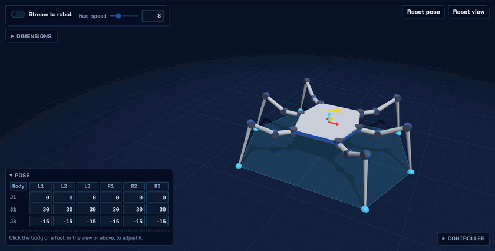
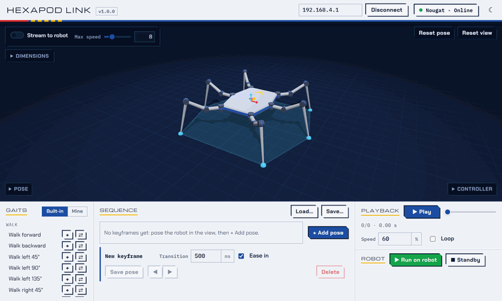
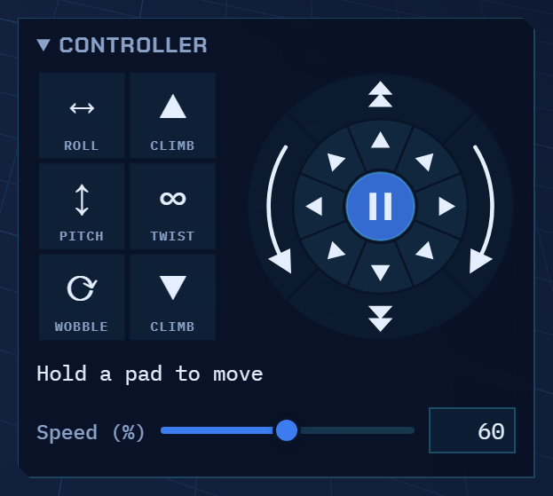

[](https://github.com/rookidroid/hexapod-link/actions/workflows/tests.yml)
[](https://github.com/rookidroid/hexapod-link/actions/workflows/build-desktop.yml)
[](./LICENSE)

# Hexapod Link


Pose, animate and drive a six-legged robot from your computer. 🕷️

Hexapod Link shows your [rookidroid](https://rookidroid.com/) hexapod in 3D.
Move its body and feet with the mouse, string poses and walks into a routine,
then play it on the real robot over WiFi. No robot yet? Everything but the
last step works without one.

<p align="center">
  
</p>

## What you can do

- **Pose it.** Click the body or a foot and drag it where you want it. The app
  works out every joint angle for you, and stops where a leg can no longer reach.
- **Choreograph it.** Collect your poses and the robot's ready-made gaits
  (walk, turn, climb, twist, ...) into a sequence, set the timing, and watch it
  play.
- **Drive it.** Hold a pad on the on-screen controller and the robot walks,
  turns or wobbles; let go and it stops.
- **See it on the real thing.** Connect over WiFi and the robot follows what
  is on screen: one pose, a whole sequence, or its own gaits.
- **Use any robot in the family.** Nougat, Mochi, Macaroon, ...: the robot
  tells the app its size and limits when it connects, so the model on screen
  always matches.

## The window

<picture><source media="(prefers-color-scheme: dark)" srcset="docs/images/app-dark.png"></picture>

Everything is on one screen:

| Where | What it is for |
|---|---|
| **Top bar** | The robot's address, **Connect**, a status light, and the ☾ / ☀ button for the light or dark theme. |
| **3D view** | The robot. Drag with the left mouse button to look around it, turn the wheel to zoom, drag with the right button to slide the view. |
| **Pose** (bottom left) | The angle of every joint, and the controls for whatever you have picked up. |
| **Stream to robot** and **Dimensions** (top left) | Send the pose to the robot as you change it; see or edit the robot's measurements. |
| **Controller** (bottom right) | Pads that drive the robot. |
| **Gaits · Sequence · Playback** (along the bottom) | Build a routine and play it. |

**Pose**, **Dimensions** and **Controller** fold away: click a heading to open
or close it.

## Get started

### 1. Install and start the app

You need a Windows or Linux computer with [Python](https://www.python.org/downloads/)
3.13 or newer. On Windows, tick **Add python.exe to PATH** in the Python
installer.

1. Download the app: on this page, **Code → Download ZIP**, then unzip it.
2. Open a terminal in the unzipped folder. On Windows: open the folder in File
   Explorer, type `cmd` in the address bar and press Enter.
3. Install what the app needs. This is only needed the first time:

   ```bash
   pip install -r requirements-desktop.txt
   ```

4. Start it:

   ```bash
   python hexapod_link.py
   ```

The window opens showing a Nougat, standing by. From then on, step 4 is all it
takes. (If your system says it cannot find `python` or `pip`, try `python3`
and `pip3`.)

<details>
<summary>Would rather use it in your web browser, or the window will not open?</summary>

The app can run in a browser tab instead of its own window. That needs less
installed, and works on any system Python does:

```bash
pip install -r requirements.txt
python hexapod_link.py --no-window --port 8050
```

Then open <http://127.0.0.1:8050> in your browser. Leave the terminal open
while you use it, and press Ctrl+C in it to quit.

On Linux, the app's own window needs a few system packages before step 3:

```bash
sudo apt install libgirepository1.0-dev libcairo2-dev pkg-config gir1.2-webkit2-4.1 libwebkit2gtk-4.1-0
```

On Windows, the window uses Microsoft's WebView2, which Windows 10 and 11
already have. If the window stays blank, install it from
[Microsoft](https://developer.microsoft.com/microsoft-edge/webview2/).

</details>

### 2. Connect your robot

Skip this if you just want to try the app: everything on screen works without
a robot.

1. Switch the robot on.
2. On your computer, **join the robot's WiFi network**. The robot makes its
   own network, so there is no internet on it; that is expected. The robot
   stands up when your computer joins.
3. In the app, press **Connect**. The address beside it is already the
   robot's (`192.168.4.1`).

The light in the top bar turns green and shows the robot's name, and the model
on screen changes to match your robot.

> [!NOTE]
> The robot needs a recent firmware, from
> [rookidroid/hexapod](https://github.com/rookidroid/hexapod)
> (`software/hexapod_esp32`). If **Connect** ends in **Fault** even though you
> are on the robot's WiFi, update the robot's firmware.

### 3. Stay safe

> [!WARNING]
> **Put the robot on a stand before you send it anything.** A pose that looks
> stable on screen is not necessarily stable on the floor, and a leg can move
> faster than you expect.

- The app never sends a joint further than the limits the robot reports.
- If the connection drops, the robot goes back to standing on its own after
  about a second.
- A sequence starts from its first pose wherever the robot is at the time, so
  the first move can be quick. Make the first pose close to standing, or press
  **Standby** before **Run on robot**.

## Pose the robot

<p align="center">
  
</p>

1. **Pick something up.** Click the body or a foot in the 3D view, or its
   button in the **Pose** panel: **Body**, or **L1** to **R3** for the left
   and right legs, front to back. Click empty space, or the button again, to
   let go.
2. **Move the body.** With the body picked, drag its arrows to shift it. To
   tilt and turn it instead, switch **Drag body to** from **Move** to
   **Rotate** at the top of the view, and drag the rings. The feet stay
   planted and the legs follow. The sliders in the **Pose** panel do the same
   thing.
3. **Move a foot.** With a foot picked, drag its arrows, or type where it
   should go: **X**, **Y** and **Up** (its height off the floor), in
   millimetres. **Put feet back** returns every foot to where it started.
4. **Start over** with **Reset pose** at the top right. **Reset view** puts
   the camera back.

The body and the feet do not undo each other: tilt the body, lift a foot, and
both stay. If you drag something further than a leg can reach, it stops at the
edge. You can also type a joint angle straight into the table.

To have the real robot follow along as you pose, turn on **Stream to robot**
at the top left. **Max speed** beside it limits how fast the servos may move.

## Build a sequence

<p align="center">
  <picture><source media="(prefers-color-scheme: dark)" srcset="docs/images/sequence-dark.gif"></picture>
</p>

A sequence is a row of **keyframes**: poses the robot moves through, one after
another, each with the time it takes to get there.

1. **Add a gait.** In **Gaits**, press **+** beside one to add a cycle of it
   to the sequence. Press **+** again for another cycle; they join up
   seamlessly. **⇄** replaces the whole sequence with that gait instead.
2. **Add your own poses.** Pose the robot, then press **+ Add pose**.
3. **Edit a keyframe.** Click it in the row. The bar underneath sets its
   **Transition** (how long the move into it takes) and **Ease in** (start and
   stop gently, rather than at a steady speed). **Save pose** overwrites it
   with the pose on screen, **◀ ▶** move it earlier or later, and **Delete**
   removes it.
4. **Watch it.** Press **Play**, or drag the slider beside it. **Speed** plays
   it all slower or faster, and **Loop** repeats it.
5. **Run it on the robot** with **Run on robot**. **Standby** stops it and
   stands the robot up.

Good to know:

- Wherever playback stops, that moment becomes the pose on screen. Adjust it
  and press **+ Add pose** to slip a new keyframe in right there.
- A foot travels in a straight line between two keyframes. To step *over*
  something rather than drag the foot along the floor, add a keyframe in
  between with the foot lifted.
- **Save…** and **Load…** keep a sequence as a file. A sequence only loads for
  the robot model it was made on.
- To keep a sequence as a gait of your own, switch **Gaits** to **Mine**, give
  it a name and press **Save sequence**. It stays in the list from then on,
  with the same **+** and **⇄** buttons as a built-in one.

## Drive it with the controller



Open **Controller** at the bottom right of the view. It is laid out like the
control screen of the
[Android app](https://play.google.com/store/apps/details?id=com.rookiedev.hexapod).

- **The circle** walks: eight directions around the middle, with fast
  forward, fast backward and the two turns around the outside. The middle
  stands the robot still.
- **The six pads** move the robot on the spot: roll, pitch, wobble and twist,
  and climbing forward and back.
- **Speed** sets how fast it goes.

Hold a pad and the robot moves; slide onto another to change; let go and it
stands. These are the robot's own built-in moves, so they stay smooth even on
a weak WiFi signal.

The controller needs a connected robot, and is greyed out until there is one.

## Tips

- The app remembers your theme, the size of the panels, which ones are folded
  and the last robot you connected, so it opens the way you left it.
- Drag the top edge of the bottom panel to make it taller or shorter, and the
  lines between its columns to resize them. Double-click an edge to put it
  back.
- Under **Dimensions** you can change the body and leg measurements to try out
  a different build. They go back to your robot's when it connects.
- Servo offsets are trimmed on the robot's own calibration page, not here.

## If something is not working

| What you see | What to try |
|---|---|
| **Connect** ends in **Fault** | Check that your computer is on the robot's WiFi network, not your home one, and that the robot is on. Hover the status light for the reason. |
| Controls are greyed out | They need a robot: **Stream to robot**, **Run on robot** and the **Controller** switch on once one is connected. |
| A leg will not go where you drag it | It has reached as far as it can, or a joint is at its limit. The **Pose** panel says which leg. |
| A sequence file will not load | It was made on a different robot model. |
| The robot's legs are a little off from the screen | Trim the servos on the robot's own calibration page. |
| The window is blank or does not open | Use the app in your browser instead: see the note under [Install and start the app](#1-install-and-start-the-app). |

## For developers

How to run from a checkout, change the look, build a standalone executable,
run the tests and regenerate the images on this page is in
[docs/DEVELOPMENT.md](docs/DEVELOPMENT.md), along with how the app talks to
the robot.

## Credits

Hexapod Link is a fork of
[mithi/hexapod-robot-simulator](https://github.com/mithi/hexapod-robot-simulator),
whose [Wiki](https://github.com/mithi/hexapod-robot-simulator/wiki/Notes)
explains the maths behind it.

Original project: [@mithi](https://github.com/mithi/),
[@philippeitis](https://github.com/philippeitis/),
[@mikong](https://github.com/mikong/), [@guilyx](https://github.com/guilyx),
[@markkulube](https://github.com/markkulube)

This fork ([rookidroid/hexapod-link](https://github.com/rookidroid/hexapod-link)):
[@rookidroid](https://github.com/rookidroid/)

## License

MIT — see [`LICENSE`](./LICENSE). Copyright (c) 2020 Mithi Sevilla, (c) 2026 rookidroid.com.


