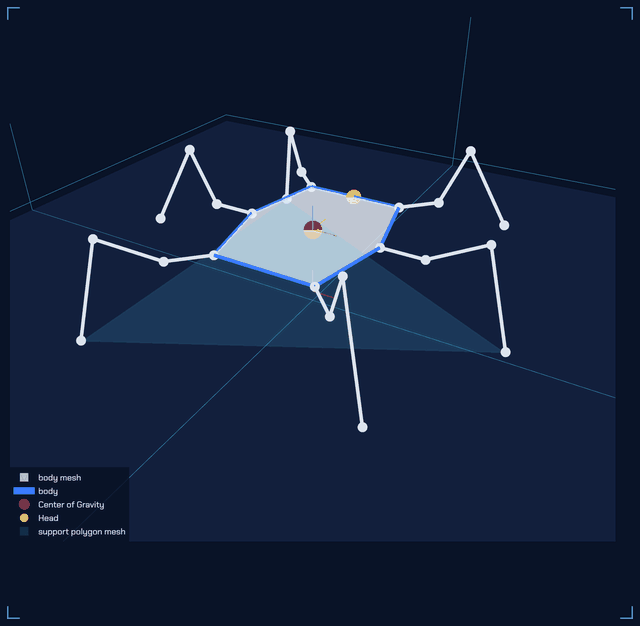
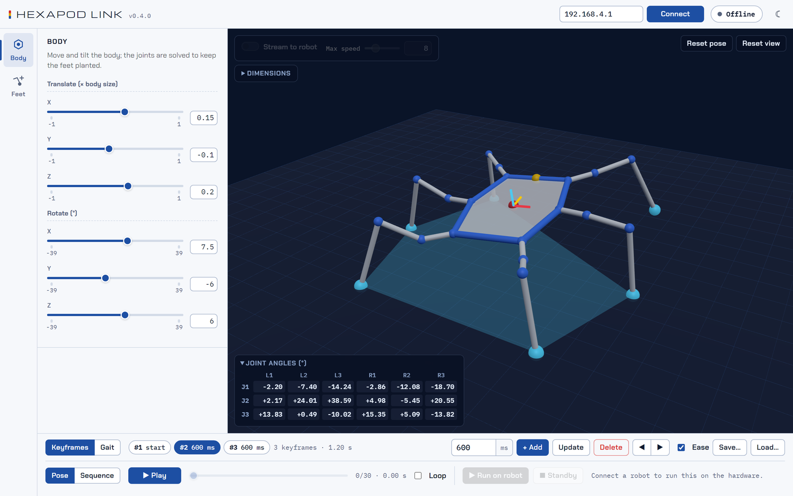

[](https://github.com/rookidroid/hexapod-link/actions/workflows/tests.yml)
[](https://github.com/rookidroid/hexapod-link/actions/workflows/build-desktop.yml)
[](./LICENSE)

# Hexapod Link


A browser-based (and desktop) hexapod robot simulator built from first
principles, with forward/inverse kinematics, gait animation, and real-time
WiFi control of a physical [rookidroid](https://rookidroid.com/) hexapod. 🕷️

This is a fork of [mithi/hexapod-robot-simulator](https://github.com/mithi/hexapod-robot-simulator),
rebranded as **Hexapod Link** and extended with a desktop app, real-robot
streaming control, and a rebuilt CI/test suite.

<p align="center">
  
</p>

# Features

| STATUS | FEATURE   | DESCRIPTION  |
|---|-----------|--------------|
| 🎉 | Forward Kinematics | Given the angles of each joint, what does the robot look like? |
| 🎉 | Inverse Kinematics | What are the angles of each joint to make the robot look the way I want? Is it even possible? Why or why not? |
| 🎉 | Gaits | Preview the robot's gaits frame by frame, and run them on it. |
| 🎉 | Pose Editor | Set a pose by moving the body and placing the feet in 3D, string the poses into a timed keyframe sequence, preview it and run it on the robot. |
| 🎉 | Customizability | Set the dimensions of the robot's body and legs, and pose that body. |
| 🎉 | Real-time Robot Control | Drive a physical ESP32 hexapod over WiFi, from single joints to whole-body gaits. Works with any robot in the family (Nougat, Mochi, Macaroon, ...): each one serves its own config. |
| 🎉 | Desktop App | Runs as a native window (Windows/Linux) via PyInstaller + pywebview, no browser required. |
| 🎉 | Light & Dark Themes | Switch from the top bar; the choice is remembered between launches. |
| 🎉 | Simplicity | Minimal dependencies. Numpy for calculations, Dash for the UI, and a bundled copy of three.js for the 3D view. |

## Preview

The screenshots follow your GitHub colour mode: light here shows the light
theme, dark shows the dark one.

<picture><source media="(prefers-color-scheme: dark)" srcset="docs/images/app-dark.png"></picture>

The whole app is one screen: pick a tool on the rail down the left — **Body**
or **Feet** — and use it on the 3D view, with the joint angles, streaming to
the robot and the robot's dimensions over the view. Along the bottom, string poses into a keyframe sequence or
pick one of the robot's gaits, preview it and run it on the robot.

Everything above is generated from the running app by
[`tools/make_screenshots.py`](./tools/make_screenshots.py), which captures it
in both themes (`app.png` and `app-dark.png` in `docs/images/`), and
the app icon by [`tools/make_icon.py`](./tools/make_icon.py). Rerun those after
a UI or theme change rather than editing the images by hand.

## Requirements

- [x] Python 3.13+ (CI runs 3.13 and 3.14)
- [x] See [`requirements.txt`](./requirements.txt) for runtime dependencies (Dash, Numpy, Flask)
- [x] See [`requirements-dev.txt`](./requirements-dev.txt) for linting/test tools
- [x] See [`requirements-desktop.txt`](./requirements-desktop.txt) for the desktop app (adds waitress, pywebview, PyInstaller)

## Run

```bash
$ pip install -r requirements.txt
$ python hexapod_link.py --no-window --port 8050
serving on http://127.0.0.1:8050 (ctrl-c to stop)
```

Then open the printed URL in a browser.

- Modify default settings with [`settings.py`](./settings.py) — joint limits, robot link ports/rates, UI resolution, etc.
- Modify the UI colours in [`assets/industrial.css`](./assets/industrial.css): the light theme's tokens are on `:root`, and the dark theme overrides them under `:root[data-theme="dark"]`.
- Modify the 3D view's colours with [`style_settings.py`](./style_settings.py). The view is a dark CAD-style monitor in both themes.
- The robot is drawn by one three.js view, [`assets/hexapod_view.js`](./assets/hexapod_view.js), fed scenes built by [`hexapod/scene.py`](./hexapod/scene.py). Left-drag orbits, the wheel zooms and right-drag pans; with the Feet tool the feet can also be picked up. The bundled three.js in `assets/vendor/` is rebuilt (with Node) by [`tools/build_three_bundle.sh`](./tools/build_three_bundle.sh).

### Light and dark themes

The ☾ / ☀ button at the right end of the top bar switches between the light and dark themes. The choice is saved to
`~/.hexapod-link/preferences.json` (set `HEXAPOD_LINK_PREFERENCES` to move it)
and applied before the first paint on the next launch, so the app opens in
whichever theme you left it in. Light is the default.

## Desktop app

The same app can run as a native window instead of in a browser: a waitress
server bound to loopback, wrapped in a [pywebview](https://pywebview.flowrl.com/)
window. No browser chrome, no dev-server warnings, and it works offline.

```bash
$ pip install -r requirements-desktop.txt
$ python hexapod_link.py
```

Useful flags: `--port` to pin the port, `--debug` for the webview developer
tools, and `--no-window` to start the server only.

### Building a standalone executable

Build from a **minimal environment**. PyInstaller follows optional-import
branches inside dependencies and bundles whatever it finds installed; built
from a rich development environment this comes out around 1 GB instead of
130 MB, mostly polars, pyarrow and Intel MKL that the app never touches.

```bash
$ python -m venv .venv-build
$ .venv-build/Scripts/pip install -r requirements-desktop.txt
$ .venv-build/Scripts/pyinstaller hexapod.spec
```

The result is `dist/HexapodLink/HexapodLink.exe`, about 130 MB in total. Set
`ONEFILE = True` in [`hexapod.spec`](./hexapod.spec) for a single
self-extracting executable instead; it is tidier to hand out but adds several
seconds to every launch.

On Windows the window renders through the Edge WebView2 runtime, which is
present on stock Windows 10/11 installs. A machine that lacks it needs the
[Evergreen Bootstrapper](https://developer.microsoft.com/microsoft-edge/webview2/).

The `build-desktop` GitHub Actions workflow builds and smoke-tests this
bundle for Windows and Linux on every push; grab the artifacts from a run if
you just want a prebuilt binary instead of building locally.

## Controlling a real hexapod

The simulator can drive a physical [rookidroid hexapod](https://rookidroid.com/)
over WiFi in real time, from a single joint up to a full gait.

### Setup

1. Flash the ESP32 firmware from the `hexapod` repo (`software/hexapod_esp32`).
   The app needs a firmware that serves its own config at `GET /robot_config`
   (protocol 1); the protocol is documented in that firmware's README.
2. Power on the robot and **join its WiFi access point** from the machine
   running this app — the ESP32 is the access point, so there is no other route
   to it. The robot performs its stand-up sequence when a client connects.
3. Start the app and press **Connect** in the top bar; the address field
   beside it starts on the robot's (`192.168.4.1`). The status pill next to it
   turns green and names the robot once it answers; hover it for the link's
   detail and the robot's firmware.

### Leg and joint numbering

Legs and joints are named the way the robot's firmware names them, so a leg
picked out in the 3D view is the leg the robot's own calibration page calls by
that name.
Legs are numbered per side, front to back; joints are numbered outward from the
body.

| Leg index | 0 | 1 | 2 | 3 | 4 | 5 |
|---|---|---|---|---|---|---|
| Shown as | Right Leg 1 | Right Leg 2 | Right Leg 3 | Left Leg 1 | Left Leg 2 | Left Leg 3 |
| In code | `right-front` | `right-middle` | `right-back` | `left-front` | `left-middle` | `left-back` |

| Joint | 1 | 2 | 3 |
|---|---|---|---|
| In code | `coxia` / `alpha` | `femur` / `beta` | `tibia` / `gamma` |

Code keeps the descriptive identifiers — they say which leg is meant without a
diagram, and the pose dicts, widget ids and point names key off them. Anything a
person reads is built from the label tables in
[`hexapod/naming.py`](./hexapod/naming.py), which is the only place the two
vocabularies meet. The joint *angles* still follow the simulator's own sign
convention; `hexapod/robot_link.py` converts them to servo angles when streaming.

### The robot's config comes from the robot

The app keeps no list of robots. Connecting first asks the robot for its config
(`GET http://<robot>/robot_config`): its name and access point, leg geometry
(mount positions and angles, link lengths, which servos are mirrored), gait
radii, joint limits, servo range, LUT frame delay, speed range and the motion
commands it knows. The simulator's body and leg dimensions switch to match, so
the on-screen hexapod agrees with the hardware. Any robot in the family --
Nougat, Mochi, Macaroon, or a new one -- works without changing this app; the
geometry lives in the firmware repo's `software/path_tool/robots/<name>.json`.

The last config received is saved to `~/.hexapod-link/robot_config.json` (set
`HEXAPOD_LINK_CONFIG_CACHE` to move it), so starting the app without a robot
still shows the last one. Before any robot has connected it shows a generic
model. See [`hexapod/robot_config.py`](./hexapod/robot_config.py).

To try the app without hardware, run the stand-in robot and connect to
`127.0.0.1:8080` (the port is for HTTP; UDP always goes to 1234):

```bash
$ python tools/fake_robot.py nougat
```

### Using it

The window is one screen: the top bar, the tool rail down the left, the
panel of the tool picked on it, the 3D view, and the dock along the bottom.

There is one pose: the robot's standby posture with two layers on top that
add up, each with its own tool on the rail:

- **Body** — translate and rotate the body over wherever the feet are
  planted; the joints are solved to keep them there.
- **Feet** — click a foot in the 3D view to pick it up, then drag the arrows
  to move it, or pick it from the list and type its **X**, **Y** and **Up**
  (height above the floor) in millimetres, or type a leg's joint angles in
  the **Joints** grid and the foot goes where they put it. A foot that
  cannot reach a spot (or would take a joint past its limit) stays where it
  was. **Put feet back** undoes the moves.

The robot's **Dimensions** fold out from the view's top-left corner, under the
stream controls, with the name of the robot they belong to. They follow the
connected robot and can be edited to try another body; foot moves are from
standby, so they keep their meaning on the resized body, and what is
streamed is solved on it too.

Neither pose tool undoes the other: tilt the body, lift a foot, and both stay,
and the Body sliders always show the pose as it is. **Reset pose**, over the
view, clears both; **Reset view** frames the robot again. The joint angles
are read out in the corner of the view (click the heading to fold them away),
and with **Stream to robot** on, in the view's top-left corner, every
reachable pose is sent to the servos as it changes. The tool and what the dock plays are remembered across
a reload.

The dock plays a sequence: the **Keyframes** collected here, or a **Gait**.
**Play** previews it in the view (**Pose** / **Sequence** switch the view
between the pose being edited and the preview), **Loop** repeats it there and
on the robot, and **Run on robot** runs it on the hardware.

With **Keyframes**, **+ Add** records the pose as a keyframe with the time it
takes to get there from the one before; click a keyframe to load it back.
**Run on robot** streams the keyframes to the hardware in real time, smoothed
to the robot's own frame rate (with gentle starts and stops, unless **Ease**
is off). Between keyframes each layer moves on its own, so a body tilting
from one keyframe to the next tilts over planted feet, while a moved foot
travels in a straight line: add a keyframe in between to lift a foot over
rather than dragging it along the floor. Sequences save to and load from
JSON files, which only load on the robot they were made for.

With **Gait**, pick one of the gaits the path tool generates; it is shown
played at the robot's own timing. **Run on robot** either triggers the
robot's own built-in gait (**Robot's own**, recommended; the ESP32 plays it
from flash so smoothness does not depend on WiFi), or streams the simulator's
frames for paths the firmware does not have (**Stream frames**). **Speed**
(20-100 % of the robot's tuned rate) applies to both and to the preview, and
is sent to the robot as soon as it changes.

Until a robot is connected the stream and run controls are greyed out, since
neither has anything to act on. Once connected, the controls in the view's
top-left corner start the sending: turn on **Stream to robot**, and **Max
speed** limits how fast any servo may slew (in servo ticks per cycle). The
switch follows the robot's actual state, so it is right after a reload.

Servo offsets are trimmed on the robot's own calibration page, served by its
firmware.

### Safety

- **Put the robot on a stand before streaming.** A pose that is stable in the
  simulator is not necessarily stable on the floor.
- Joint angles are clamped to the robot's mechanical limits before being sent
  (`jointLimits` in the robot's config), because the simulator allows far more
  travel than the hardware has. Widen these only after checking clearances.
- If the stream stops, the robot eases back to standby on its own after 1 s.
- A keyframe sequence starts from its first keyframe wherever the robot is,
  so the first move is as fast as the servos' slew limit allows. Make the first
  keyframe close to standby, or press **Standby** before **Run**.

## Testing

```bash
$ pip install -r requirements-dev.txt
$ pytest
```

The suite (~1950 lines across [`tests/`](./tests)) covers forward/inverse
kinematics, leg patterns, path/motion generation, keyframe sequences,
leg-naming conversions, the robot-link streaming protocol, reading each robot's config (against
`tools/fake_robot.py`), and the saved UI preferences — all without needing a
display, a browser, or a physical robot.

## CI/CD

- [`tests.yml`](./.github/workflows/tests.yml) — runs `pytest` on Ubuntu and
  Windows across Python 3.13/3.14, and byte-compiles + imports every module to
  catch dead code the tests don't reach.
- [`build-desktop.yml`](./.github/workflows/build-desktop.yml) — builds the
  PyInstaller desktop bundle for Windows and Linux, smoke-tests that the built
  binary actually serves a page, and (Windows) verifies the Mark of the Web is
  cleared from bundled DLLs.
- [Dependabot](./.github/dependabot.yml) — weekly update checks for both pip
  dependencies and GitHub Actions versions.

## More Information
The original project's [Wiki](https://github.com/mithi/hexapod-robot-simulator/wiki/Notes)
has additional background on the kinematics math this simulator is built on.

## 🤗 Contributors

Original project ([mithi/hexapod-robot-simulator](https://github.com/mithi/hexapod-robot-simulator)):
- [@mithi](https://github.com/mithi/)
- [@philippeitis](https://github.com/philippeitis/)
- [@mikong](https://github.com/mikong/)
- [@guilyx](https://github.com/guilyx)
- [@markkulube](https://github.com/markkulube)

This fork ([rookidroid/hexapod-link](https://github.com/rookidroid/hexapod-link)):
- [@rookidroid](https://github.com/rookidroid/)

## License

MIT — see [`LICENSE`](./LICENSE). Copyright (c) 2020 Mithi Sevilla, (c) 2026 rookidroid.com.


